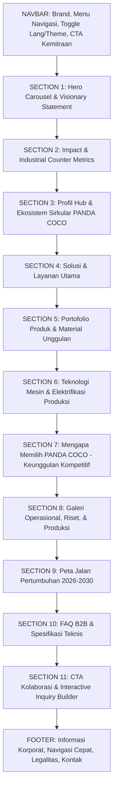

# PANDA COCO — STRATEGI BRAND, ARSITEKTUR KONTEN & BLUEPRINT WEBSITE
**PANdeglang Domestic Agro COCOnut · Circular Agro-Biomass Platform**
*Lokasi: Kampung Keboncau, Kelurahan Pandeglang, Kabupaten Pandeglang, Provinsi Banten*

---

## 1. Ringkasan Eksekutif & Reposisi Brand

### 1.1. Latar Belakang & Mandat Transformasi
Dokumen ini menyatukan keunggulan struktur industri dari [Referensi.html](file:///d:/tes/Kita%20tumbuh/kita-tumbuh/doc/Referensi.html) (model PT Binco Ran Nusantara) dengan substansi data riil dari proposal program [pandacoco.md](file:///d:/tes/Kita%20tumbuh/kita-tumbuh/doc/pandacoco.md) (PANDA COCO Pandeglang).

Tujuan utama reposisi ini adalah:
1. **Mengubah Tone dari *Touchful* (jual kesedihan/meratapi kemiskinan) menjadi *Powerful* (kekuatan teknologi, inovasi material, dan potensi ekonomi tinggi).**
2. **Menampilkan PANDA COCO sebagai Produsen Agro-Biomassa Sirkular Modern** yang berbasis teknologi mesin listrik (*Electrifying Agriculture*), memiliki standar kualitas industri terukur, dan menggerakkan rantai pasok terintegrasi dari hulu ke hilir.
3. **Memposisikan masyarakat (petani dan 100 perempuan penggerak) bukan sebagai objek belas kasihan**, melainkan sebagai **aktor industri ahli, operator teknologi terampil, dan mitra setara yang berdaya saing**.

---

### 1.2. Perbandingan Paradigma Komunikasi: *Touchful* vs *Powerful*

| Elemen Narasi | Pendekatan Lama (*Touchful / Vulnerable-Centric*) | Pendekatan Baru PANDA COCO (*Powerful / Potential & Tech-Driven*) |
| :--- | :--- | :--- |
| **Fokus Utama** | Menyoroti kemiskinan (8,51%), pengangguran (8,80%), dan beban ibu rumah tangga yang kekurangan nafkah. | Menyoroti **kekayaan 23.900 ton kelapa Pandeglang** dan bagaimana PANDA COCO membuka **kapital biomassa bernilai ekonomi tinggi**. |
| **Framing Sabut Kelapa** | Limbah terbuang yang dikotori dan dibakar di pinggir jalan karena warga tidak mampu. | **Biomaterial rekayasa hayati**: serat kaya lignin berdaya tarik tinggi, matriks seluler penyimpan air 8x, dan sumber karbon padat terbarukan. |
| **Peran Komunitas & Perempuan** | "Ibu-ibu prasejahtera yang dibantu agar tidak menganggur." | **"OPTIMALKAN IBU: 100 Profesional Perempuan Penggerak Industri Hijau"** (operator mesin presisi, kurator mutu *quality control*, pengelola agro-hub terdesentralisasi). |
| **Peran Petani** | "Petani miskin yang menjual kelapa murah karena jalan rusak." | **"Rantai Pasok Agroforestri Berkeadilan"**: 60 mitra petani pemilik 3.000 pohon kelapa dengan jaminan serapan bahan baku terukur. |
| **Dukungan PLN** | "Bantuan sosial CSR/TJSL untuk meringankan beban warga desa." | **"Katalisator Elektrifikasi Pertanian (*Electrifying Agriculture*)"**: transisi energi bersih menggantikan mesin fosil dengan efisiensi listrik terukur, rendah emisi, dan berdaya saing operasional. |
| **Target Audiens** | Donatur, pengamat isu sosial, pemerintah yang memberi bansos. | **Mitra B2B, industri manufaktur, distributor hortikultura, arsitek/desainer material interior, investor hijau, dan eksportir**. |

---

## 2. Identitas Brand PANDA COCO

* **Nama Brand**: **PANDA COCO**
* **Akronim**: *PANdeglang Domestic Agro COCOnut*
* **Deskripsi Singkat**: Platform Agro-Biomassa Sirkular Berbasis Komunitas dan Teknologi Listrik Modern di Pandeglang, Banten.
* **Tagline Utama**:
  * *Bahasa Indonesia*: **"Membuka Nilai Tertinggi di Setiap Serat Kelapa."**
  * *Alternatif*: **"Agro-Biomassa Presisi. Industri Sirkular Berdaya."**
  * *English*: **"Unlocking High-Performance Value from Every Coconut Fiber."**
* **Pilar Nilai Brand**:
  1. **Material Excellence**: Produk berbasis riset seluler serat, bebas kimia sintetis, dan ramah lingkungan.
  2. **Clean Electrified Processing**: Lini produksi bertenaga listrik efisien yang menekan jejak karbon.
  3. **Local Supply Sovereignty**: Bahan baku bersumber langsung dari 3.000 pohon kelapa lokal terkelola.
  4. **Women-Led Industrial Agility**: Dipimpin dan dioperasikan oleh perempuan tangguh terlatih.

---

## 3. Struktur & Blueprint Halaman Website (Mengadopsi Keunggulan Referensi.html)

Struktur ini mengadaptasi layout modular responsif, navigasi intuitif, dan elemen komersial dari [Referensi.html](file:///d:/tes/Kita%20tumbuh/kita-tumbuh/doc/Referensi.html), disesuaikan secara presisi dengan data operasional PANDA COCO di Keboncau, Pandeglang.

---

## 4. Rincian Konten Per Section (Copywriting Siap Pakai)

### SECTION 1: HERO CAROUSEL (Dinamis, Tegas, & Percaya Diri)

#### Slide 1: Fokus pada Transformasi Nilai Biomassa
* **Eyebrow Tag**: `[IKON LEAF]` SOLUSI AGRO-INDUSTRI SIRKULAR
* **Headline**: **Mengubah Biomassa Kelapa Menjadi Produk Bernilai Ekonomi Tinggi.**
* **Subheadline**: PANDA COCO menghadirkan sistem terintegrasi pemanfaatan sabut dan tempurung kelapa di Pandeglang. Didukung teknologi mesin modern bertenaga listrik, kami memproduksi biomaterial ramah lingkungan berstandar industri yang memperkuat ekonomi hijau regional.
* **CTA Button 1**: `Layanan & Produk Kami` (Anchor ke `#produk`)
* **CTA Button 2**: `Mulai Kemitraan B2B` (Link ke `/kontak`)

#### Slide 2: Fokus pada Inovasi Material & Green Panel
* **Eyebrow Tag**: `[IKON CPU]` MATERIAL BIOPERFORMA MASA DEPAN
* **Headline**: **PANDA COCO Green Panel: Inovasi Serat Alami Pengganti Material Fosil.**
* **Subheadline**: Melalui pemisahan presisi dan pencetakan hidrolik terstandar, serat sabut kelapa bertransformasi menjadi panel akustik, media tanam kaya retensi air, serta bahan bakar karbon bersih minim emisi.
* **CTA Button 1**: `Lihat Spesifikasi Material` (Link ke `/material`)
* **CTA Button 2**: `Ajukan Sampel Produk` (Anchor ke `#kontak-cta`)

#### Slide 3: Fokus pada Elektrifikasi & Pemberdayaan Tangguh
* **Eyebrow Tag**: `[IKON ZAP]` TEKNOLOGI BERSIH & INKLUSIVITAS PRODUKTIF
* **Headline**: **Ditenagai Energi Bersih, Digerakkan oleh 100 Perempuan Berdaya.**
* **Subheadline**: Bersama sinergi *Electrifying Agriculture* PLN dan inisiatif OPTIMALKAN IBU, kami membuktikan bahwa rantai pasok industri berkelanjutan lahir dari integrasi energi modern dan kepemimpinan komunitas lokal yang mandiri.
* **CTA Button 1**: `Kenali Model Sirkular Kami` (Link ke `/tentang`)
* **CTA Button 2**: `Unduh Profil Usaha` (File PDF)

---

### SECTION 2: METRIK INDUSTRIAL & PENCAPAIAN TERUKUR (Counter Bar)

Grid 4 kolom dengan aksen visual gradien hijau hutan (*forest*) dan aksen emas (*gold*):

1. **24+ Ton/Tahun**  
   *Sub-label*: Kapasitas Olah Sabut Kelapa Terpadu (2.000 kg/bulan fase awal).
2. **100+ Personel Terlatih**  
   *Sub-label*: Operator Perempuan & Tenaga Ahli Pengolahan (Program OPTIMALKAN IBU).
3. **60 Petani Mitra Inti**  
   *Sub-label*: Terintegrasi di 3.000 Pohon Kelapa Produktif Kampung Keboncau.
4. **100% Elektrifikasi Produksi**  
   *Sub-label*: Mesin Rendah Emisi Didukung Penuh oleh *PLN Electrifying Agriculture*.

---

### SECTION 3: TENTANG PANDA COCO (Profil Agro-Hub & Ekosistem)

* **Label Atas**: TENTANG PANDA COCO · PANDEGLANG DOMESTIC AGRO COCONUT
* **Judul**: **Pusat Hilirisasi Biomassa Kelapa Terpadu Berbasis Komunitas dan Teknologi.**
* **Deskripsi Editorial**:
  > PANDA COCO lahir dari tekad memposisikan Kabupaten Pandeglang—daerah penghasil lebih dari 23.900 ton kelapa per tahun—sebagai episentrum biokomposit dan agro-material terbarukan di Banten.  
  >  
  > Berpusat di Kampung Keboncau, kami mengoperasikan *Coconut Waste Circular Economy Hub*. Kami menolak pembuangan sia-sia dan pembakaran terbuka. Dengan rekayasa mekanis bersih bertenaga listrik, sabut dan tempurung kelapa diproses menjadi tiga produk bernilai tinggi: **Cocofiber** berkualitas ekspor, **Cocopeat** berdaya serap superior, dan material akustik arsitektural **PANDA COCO Green Panel**.
* **4 Kartu Sorotan Keunggulan**:
  1. `[IKON AWARD]` **Standar Manufaktur Terkontrol**: Pemilahan mekanis tanpa zat kimia berbahaya, pencucian air hujan desalinasi, dan kontrol kadar tanin/EC ketat.
  2. `[IKON ZAP]` **Elektrifikasi Produksi Ramah Lingkungan**: Mengeliminasi mesin diesel berbahan bakar fosil; operasional lebih higienis, senyap, efisien, dan rendah jejak karbon.
  3. `[IKON USERS]` **OPTIMALKAN IBU**: Manajemen operasional, pengawasan mutu, dan perakitan produk dipimpin langsung oleh tenaga kerja perempuan tangguh terlatih.
  4. `[IKON HANDSHAKE]` **Rantai Pasok Adil & Berkelanjutan**: Sistem kemitraan langsung dengan 60 petani kelapa yang memberikan kepastian harga di atas fluktuasi pasar tengkulak.

---

### SECTION 4: LAYANAN & KAPABILITAS UTAMA (Services)

Mengadopsi format 8-card grid interaktif dari `Referensi.html`:

1. **Produksi Biomaterial Bersih**: Pengolahan sabut kelapa menjadi serat panjang (*cocofiber*) dan serbuk berpori (*cocopeat*) dengan spesifikasi industri.
2. **Rekayasa Biokomposit Green Panel**: Fabrikasi panel arsitektural dan akustik ramah lingkungan dari serat sabut padat menggunakan perekat nabati aman.
3. **Penyediaan Media Tanam Hortikultura**: Formulasi cocopeat organik bebas gulma dengan pH seimbang (5,8–6,5) sebagai pengganti gambut alam (*peat moss replacement*).
4. **Bio-Energi Ramah Lingkungan**: Pemanfaatan 0,9 ton tempurung kelapa per bulan menjadi briket arang berkalori tinggi (7.200 kkal/kg) tanpa deforestasi.
5. **Kemitraan Pasokan Bahan Baku B2B**: Kontrak suplai teratur bagi distributor hortikultura, produsen furnitur, industri matras, dan konstruksi geotekstil.
6. **Pelatihan & Alih Teknologi (OPTIMALKAN IBU)**: Modul vokasi pengoperasian mesin industri, keselamatan kerja (K3), dan manajemen mutu untuk komunitas lokal.
7. **Edukasi Ekonomi Sirkular Agro**: Program studi banding dan laboratorium lapangan bagi universitas, instansi, dan pemangku kebijakan hilirisasi perkebunan.
8. **Konsultasi Rantai Pasok Terdesentralisasi**: Pendampingan replikasi model *micro-hub* pengolahan kelapa untuk daerah penghasil kelapa lainnya di Indonesia.

---

### SECTION 5: KATALOG PRODUK & MATERIAL UNGGULAN (Products Showcase)

#### 1. PANDA COCOfiber (High-Tensile Golden Fiber)
* **Kategori**: Bahan Baku Serat Industri & Bio-Tekstil
* **Spesifikasi**: Serat panjang keemasan, kadar air < 15%, kadar kotoran < 3%, kaya lignin alami.
* **Keunggulan Teknis**: Tahan terhadap pelapukan biologis, elastisitas tinggi, daya tahan terhadap air asin, isolator termal alami.
* **Aplikasi**: Matras ortopedik, jok mobil ramah lingkungan, tali tambang kapal, jaring penahan erosi (*coir net / geotextiles*), penguat komposit industri.

#### 2. PANDA COCOpeat (Premium Moisture Sponge)
* **Kategori**: Media Tanam Bebas Gambut (*Peat Moss Alternative*)
* **Spesifikasi**: Serbuk berpori seluler, retensi air hingga 800% (8x bobot kering), electrical conductivity (EC) rendah terverifikasi, pH stabil 5,8–6,5.
* **Keunggulan Teknis**: Mengoptimalkan aerasi akar tanaman, menghemat penggunaan air irigasi hingga 50%, melindungi ekosistem lahan basah gambut alami dari eksploitasi.
* **Aplikasi**: Rumah bibit (*greenhouse nursery*), hidroponik komersial, perbaikan struktur tanah pertanian, substrat tanaman hias ritel.

#### 3. PANDA COCO Green Panel (Acoustic & Interior Composite)
* **Kategori**: Material Interior & Arsitektur Sirkular
* **Spesifikasi**: Panel serat sabut padat kompresi hidrolik, perekat nabati tanpa formalin, ketebalan 10–25 mm, densitas terkalibrasi.
* **Keunggulan Teknis**: Peredam gema akustik alami dengan koefisien serap suara tinggi, insulasi panas ruangan, tekstur estetik natural yang elegan.
* **Aplikasi**: Panel dinding studio/kantor, partisi modular ramah lingkungan, plafon akustik, furnitur sirkular.

#### 4. PANDA COCO Bio-Briket (High-Calorie Shell Charcoal)
* **Kategori**: Energi Bersih & Karbon Hayati Terbarukan
* **Spesifikasi**: Pirolisis batok tua rendah emisi, kadar abu < 3%, nilai kalor ~7.200 kkal/kg, waktu bakar hingga 3x arang kayu.
* **Keunggulan Teknis**: Pembakaran tanpa asap pedih, tidak berbau, tanpa merusak hutan (100% dari limbah tempurung pascapanen).
* **Aplikasi**: Bahan bakar pemanggang kuliner higienis, pemanas industri kecil, karbon aktif filtrasi air.

---

### SECTION 6: TEKNOLOGI MESIN & ELEKTRIFIKASI PRODUKSI (Machinery)

PANDA COCO membuktikan efisiensi operasional dengan meninggalkan mesin diesel kuno dan beralih ke lini produksi bertenaga listrik yang higienis, bersih, dan hemat biaya operasional:

1. **Mesin Pengurai Sabut Listrik (Electric Decorticator Hub)**
   * *Fungsi*: Memisahkan serat kasar (*fiber*) dan serbuk halus (*peat*) dari sabut kelapa secara kontinyu.
   * *Kapasitas*: 30–35 kg sabut mentah per jam, motor listrik 3-phase efisien, getaran rendah, bebas polusi knalpot.
2. **Mesin Ayakan Silinder Putar (Rotary Sifter & Fiber Polisher)**
   * *Fungsi*: Memisahkan cocopeat murni dari serat pendek yang masih terbawa sekaligus merapikan serat cocofiber agar siap dipress.
   * *Kelebihan*: Pengaturan ukuran mesh presisi menghasilkan serbuk cocopeat berpori seragam dan serat bersih bebas debu.
3. **Mesin Press Hidrolik Elektrik (Hydraulic Baling & Panel Press)**
   * *Fungsi*: Memadatkan cocofiber menjadi bal standar pengiriman, mencetak briket cocopeat block, dan mencetak lembaran PANDA COCO Green Panel.
   * *Daya Tekan*: Hingga 10–15 ton, kontrol tekanan presisi menghasilkan dimensi geometris rapi yang efisien untuk logistik.
4. **Instalasi Pencucian Desalinasi & Pengeringan Surya Beratap**
   * *Fungsi*: Membilas kandungan tanin dan garam berlebih menggunakan air bersih, dilanjutkan pengeringan terkontrol di bawah kubah jemur berventilasi.

---

### SECTION 7: MENGAPA MEMILIH PANDA COCO? (Keunggulan Kompetitif B2B)

Format 4 kartu besar dengan ikon dan penjelas yang kuat:

1. **100% Bahan Alami & Bersumber dari Ekosistem Lokal Terlacak**
   * Setiap kilogram produk kami dapat ditelusuri langsung ke 60 petani dan 3.000 pohon kelapa di Keboncau, Pandeglang. Kami menjamin pasokan stabil tanpa perantara spekulatif.
2. **Mutu Industri Teruji & Bebas Bahan Kimia Berbahaya**
   * Produk kami melewati standardisasi pencucian, pengayakan terkalibrasi, serta pengujian berkala terhadap kadar air, pH, dan EC agar siap pakai di lini manufaktur Anda.
3. **Solusi Dekarbonisasi Riil untuk Rantai Pasok Anda**
   * Bermitra dengan PANDA COCO membantu perusahaan Anda memenuhi target keberlanjutan (ESG / Scope 3 emissions), menggantikan plastik sekali pakai dan menghentikan emisi pembakaran limbah terbuka.
4. **Dampak Sosial yang Nyata & Terverifikasi (Bukan Sekadar Cerita)**
   * Setiap pembelian produk langsung mendanai kepastian pendapatan keluarga petani dan memperluas kapasitas kerja 100 perempuan pelaku industri hijau di Pandeglang.

---

### SECTION 8: PETA JALAN PERTUMBUHAN STRATEGIS (Roadmap 2026–2030)

Menampilkan visi industri jangka panjang yang terukur dan meyakinkan bagi mitra maupun investor:

* **Fase 1 (2026) · Pondasi & Validasi Model**:
  * Pembentukan Kelompok Usaha PANDA COCO & kurikulum pelatihan OPTIMALKAN IBU.
  * Instalasi mesin pengolahan listrik dan optimalisasi kapasitas 2 ton sabut/bulan.
  * Peluncuran prototipe PANDA COCO Green Panel & uji pasar cocopeat/cocofiber regional.
* **Fase 2 (2027) · Standardisasi & Legalitas Formal**:
  * Pengurusan Nomor Induk Berusaha (NIB), sertifikasi uji laboratorium mutu material, dan pendaftaran hak merek.
  * Pembentukan kelembagaan Koperasi Produsen Sirkular Keboncau.
  * Ekspansi jaringan pembeli tetap di sektor pembibitan hortikultura Banten dan Jabodetabek.
* **Fase 3 (2028) · Ekspansi Kapasitas & Agregasi Regional**:
  * Peningkatan kapasitas olah menjadi 5–10 ton sabut/bulan dengan penambahan unit mesin listrik.
  * Perluasan jejaring pemasok bahan baku ke kampung-kampung sekitar di Pandeglang.
  * Produksi massal PANDA COCO Green Panel untuk pasar interior komersial.
* **Fase 4 (2029) · Penetrasi Nasional & Konsorsium Ekspor**:
  * Distribusi skala nasional untuk lini Living, Grow, dan Green Panel.
  * Kolaborasi dengan agregator ekspor untuk pengiriman cocofiber dan bio-briket ke pasar Asia & Eropa.
* **Fase 5 (2030) · Replikasi Model Circular Agro-Hub**:
  * Menularkan model sentra pengolahan kelapa berbasis listrik ke kecamatan penghasil kelapa lainnya di Kabupaten Pandeglang dan Banten Selatan.

---

### SECTION 9: PERTANYAAN UMUM / FAQ (Menjawab Kebutuhan Klien & Mitra)

1. **Apa yang membedakan Cocopeat PANDA COCO dengan cocopeat curah di pasaran?**
   * Cocopeat PANDA COCO diproses melalui pencucian terkontrol untuk menurunkan kadar tanin dan natrium klorida alami (Low EC), diayak dengan mesh seragam, dan memiliki pH ideal (5,8–6,5), sehingga aman digunakan langsung sebagai media semai bibit sensitif tanpa risiko terbakar akar.
2. **Apakah PANDA COCO Green Panel tahan terhadap rayap dan kelembapan tropis?**
   * Ya. Serat sabut kelapa secara alami kaya akan lignin (~45%), polimer alami keras yang tidak disukai serangga perusak kayu dan sangat tahan terhadap jamur pelapuk. Panel kami dicetak dengan perekat nabati tahan lembap yang menjadikannya awet untuk interior jangka panjang.
3. **Bagaimana kapasitas pasokan bahan baku PANDA COCO dijamin tidak terputus?**
   * Kami memegang kontrak pasokan bahan baku tertulis dengan 60 petani mitra yang mengelola 3.000 pohon kelapa aktif dengan ritme panen bulanan teratur (~7.000 butir/bulan). Kami juga memiliki cadangan pasokan dari sentra kelapa sekitarnya di Kabupaten Pandeglang.
4. **Apakah PANDA COCO melayani pesanan khusus (custom specification) untuk kebutuhan industri?**
   * Ya. Kami melayani penyesuaian panjang serat cocofiber, tingkat kelembapan, densitas press panel interior, hingga kemasan ritel berlabel khusus (*white-label*) untuk jaringan toko tanaman dan nursery.
5. **Bagaimana cara menjadwalkan kunjungan lapangan ke Hub PANDA COCO di Keboncau?**
   * Kami menyambut terbuka kunjungan mitra bisnis, akademisi, dan calon pembeli institusi. Silakan hubungi kami minimal 3 hari sebelum jadwal rencana melalui formulir kontak atau WhatsApp resmi kami untuk pengaturan tur teknis fasilitas.

---

### SECTION 10: CALL TO ACTION & FORMULIR KEMITRAAN (B2B Lead Generator)

* **Badge Atas**: `[IKON SPARKLES]` MARI MEMBANGUN EKOSISTEM HIJAU
* **Judul Besar**: **Siap Membuka Potensi Baru Bersama PANDA COCO?**
* **Paragraf Ajakan**: Baik Anda pelaku industri furnitur yang membutuhkan serat alami berdaya tahan tinggi, pengembang hortikultura yang membutuhkan substrat cocopeat berkualitas stabil, maupun arsitek yang merancang interior sirkular—PANDA COCO siap menjadi mitra strategis Anda.
* **Tombol Interaksi**:
  1. `[IKON WHATSAPP]` **Konsultasi Kemitraan via WhatsApp (+62 8xx-xxxx-xxxx)**
  2. `[IKON MAIL]` **Kirim Brief Kolaborasi Resmi**
  3. `[IKON DOWNLOAD]` **Unduh Spesifikasi Teknis & Brosur (PDF)**

---

## 5. Implementasi Teknis ke Codebase Website Saat Ini

Untuk menerapkan strategi dan konten PANDA COCO ini ke dalam aplikasi Next.js yang ada di repositori:

1. **Update file terjemahan**:
   * File [messages/id.json](file:///d:/tes/Kita%20tumbuh/kita-tumbuh/messages/id.json): Ganti entitas nama brand, perbarui teks hero, narasi transformasi, katalog produk (Green Panel, Cocofiber, Cocopeat, Bio-briket), data statistik Pandeglang/Keboncau, dan hapus kalimat-kalimat melankolis/jual kesedihan.
   * File [messages/en.json](file:///d:/tes/Kita%20tumbuh/kita-tumbuh/messages/en.json): Sesuaikan versi bahasa Inggris dengan tone *powerful agro-industrial circular solutions*.
2. **Update Metadata & SEO**:
   * Meta Title: *"PANDA COCO | Inovasi Biomassa Kelapa & Material Sirkular Pandeglang"*
   * Deskripsi Meta: Menegaskan kapasitas industri, elektrifikasi produksi, produk Green Panel, Cocofiber, dan Cocopeat.
3. **Data Fallback**:
   * Perbarui [lib/data/fallback.ts](file:///d:/tes/Kita%20tumbuh/kita-tumbuh/lib/data/fallback.ts) agar memuat metrik: 24 ton sabut/tahun, 100 penggerak perempuan OPTIMALKAN IBU, 60 petani Keboncau, serta produk PANDA COCO Green Panel.

---
*Dokumen ini dirancang sebagai acuan baku strategi desain visual, tata kelola komunikasi publik, dan pengembangan antarmuka platform PANDA COCO.*
